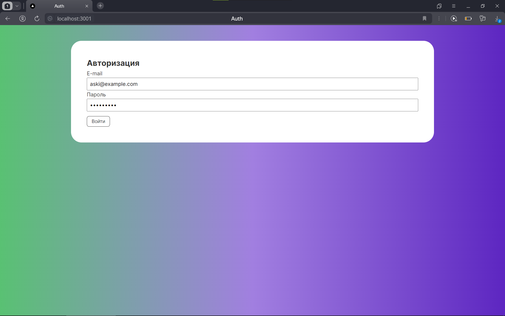
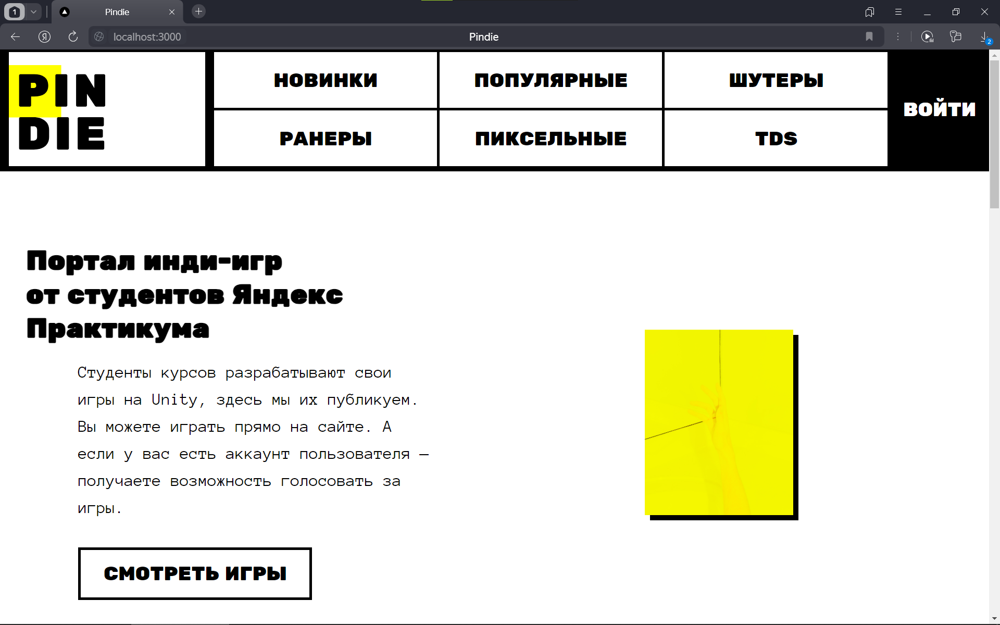
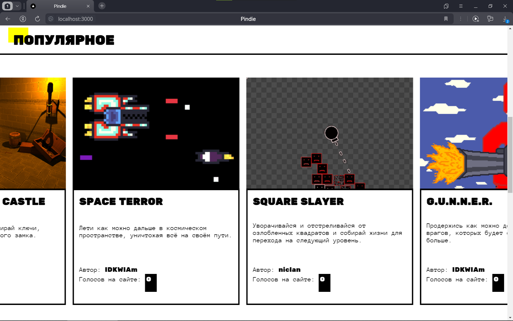
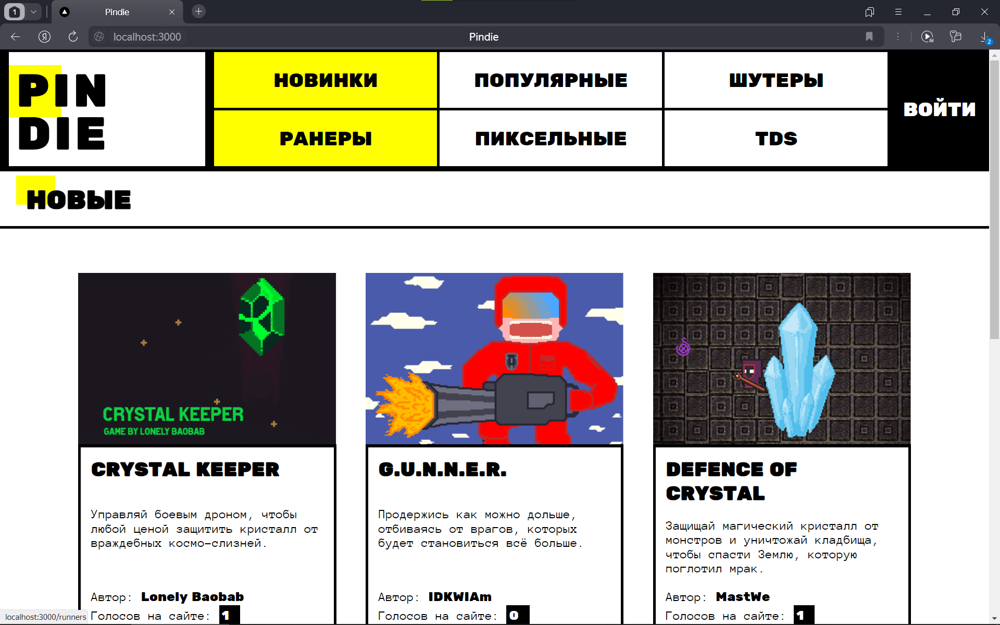
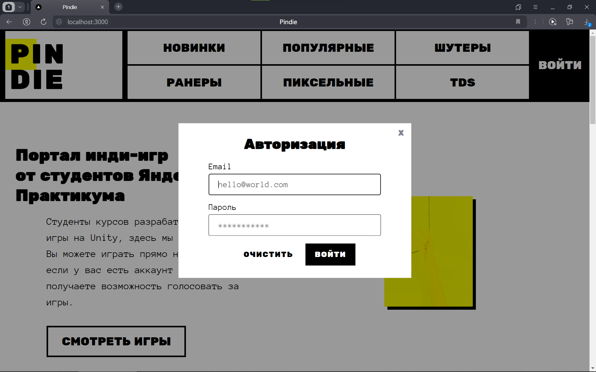

# Pindie-backend
Это бэкенд часть проекта Pindie, онлайн каталога игр, созданных студентами курса от Яндекс Практикума. Проект был выполнен в рамках программы [Код Будущего](https://free-code.ru/).
<br>
[Здесь](https://github.com/rmd09/Pindie) ты можешь найти фронтенд.
<br>
А [здесь](#скриншоты) - скриншоты сайта

## Как запустить
Чтобы проект заработал, нужно запустить одновременно как фронтенд, так и бэкенд с базой данных. А также установить все необходимые зависимости.

### Необходимые зависимости
1. [VS Code](https://code.visualstudio.com/download)
2. [Node.js](https://nodejs.org/en/download/prebuilt-installer)
3. [MongoDB](https://www.mongodb.com/docs/manual/tutorial/install-mongodb-on-windows-unattended/#std-label-install-mdb-community-windows-msiexec), также установите MongoDB Compass (нужно поставить галочку в установщике)

### Запуск проекта
1. Скачайте фронтенд и бэкенд проекта с GitHub
2. Откройте обе части проекта в двух разных окнах vs code
3. [Импортируйте данные в MongoDB](#импорт-данных-mongodb)
4. [Запустите бэкенд](#запуск-бэкенда)
5. [Запустите фронтенд](#запуск-фронтенда)
6. Перейдите по ссылке [http://localhost:3000](http://localhost:3000) (сайт с играми) или по ссылке [http://localhost:3001](http://localhost:3001) (админка)

Также можете посмотреть [список пользователей по умолчанию](docs/users.md), чтобы авторизоваться, вносить изменения, а также создавать новых пользователей, новые игры и категории.

### Импорт данных MongoDB
1. После установки, откройте MongoDB Compass
2. Создайте новую базу данных под названием ```pindie``` с папками ```categories```, ```games``` и ```users```
3. Откройте репозиторий бэкенда и перейдите в папку ```compass-export```
4. Теперь импортируйте json-файлы в соответствующие папки базы данных

### Запуск бэкенда
Откройте терминал и запустите соответствующие команды
```bash
#Установка зависимостей
npm i
#Запуск бэкенда
npm run start
```

### Запуск фронтенда
Откройте терминал и запустите соответствующие команды
```bash
#Установка зависимостей
npm i
#Запуск фронтенда
npm run dev
```

# Скриншоты
## Админка


<br>

<br>

<br>

<br>


## Сайт Pindie


<br>

<br>

<br>
